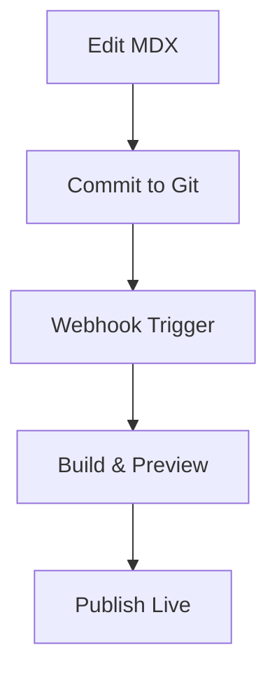

## Overview

Documentation.AI empowers you to build dynamic documentation sites with minimal effort. You access reusable components for consistent styling, an AI assistant for instant content generation, seamless publishing workflows, and tools to convert static manuals into interactive knowledge bases. These features streamline your workflow from creation to maintenance.

<Columns cols={3}>
  <Card title="Reusable Components" icon="puzzle" href="#reusable-components">
    Build consistent docs with pre-built MDX elements like `<Callout>` and `<Steps>`.
  </Card>
  <Card title="AI Assistant" icon="bot" href="#ai-assistant">
    Generate sections, suggest improvements, and answer queries in real-time.
  </Card>
  <Card title="Dynamic Publishing" icon="upload-cloud" href="#publishing">
    Publish updates instantly and maintain living documentation.
  </Card>
</Columns>

## Reusable Components

Reusable components ensure your documentation maintains a professional, uniform look. You integrate elements like `<Tabs>`, `<Steps>`, and `<CodeGroup>` directly into MDX files. This approach saves time and enforces branding consistency.

<Callout kind="tip">
  Start with the component library to preview live examples and copy-paste code.
</Callout>

Follow these steps to incorporate components:

<Steps>
  <Step title="Install MDX Support" icon="download">
    Add MDX processing to your build tool.

````bash
npm install @mdx-js/loader
````

  </Step>
  <Step title="Import Components" icon="code">
    Import from the Documentation.AI package.

````javascript
import { Callout, Steps } from '@documentation-ai/components';
````

  </Step>
  <Step title="Use in Pages" icon="edit-3">
    Embed in your `.mdx` files for instant rendering.
  </Step>
</Steps>

## AI Assistant

The AI assistant accelerates content creation by generating full sections or refining existing text. You interact via the dashboard editor or CLI for suggestions on structure, clarity, and completeness.

<Tabs>
  <Tab title="Dashboard" icon="monitor">
    Open your project in the dashboard at `https://dashboard.documentation.ai`.

    1. Highlight text and select "Generate Suggestions".
    2. Choose "Expand Section" or "Simplify Language".
    3. Review and apply AI outputs seamlessly.
  </Tab>
  <Tab title="CLI" icon="terminal">
    Use the command-line tool for batch processing.

````bash
docs-ai generate --file features.mdx --mode suggestions
docs-ai write --prompt "Explain reusable components" --output new-section.mdx
````
  </Tab>
</Tabs>

<CodeGroup tabs="JavaScript,Python">
```javascript
// Example: AI-generated component usage
import { Callout } from '@documentation-ai/components';

<Callout kind="info">
  AI suggested this callout for key tips.
</Callout>;
```
```python
# Python integration example
from documentation_ai import AIAssistant

assistant = AIAssistant(api_key="YOUR_API_KEY")
content = assistant.generate("Document Steps component")
print(content)
```
</CodeGroup>

## Publishing and Maintaining

Publish your documentation with one-click deploys to a custom domain. The platform handles versioning, previews, and automatic updates, keeping your docs always current.

<Expandable title="Advanced Maintenance Workflow" default-open="false">

Maintain dynamic docs by enabling webhooks for Git integration.



Set webhook URL: `https://hooks.documentation.ai/your-project/webhook`.

</Expandable>

## Transforming Static Manuals

Convert legacy PDFs or static Markdown into interactive hubs. Upload files, let AI parse and enhance with components, then publish as a searchable site.

1. Upload your manual to the dashboard.
2. AI auto-generates structure with headings and components.
3. Customize with `<Tabs>` for multi-version support.
4. Deploy as an interactive hub with search and navigation.

This process turns passive documents into active resources where users get instant answers through AI-powered search.