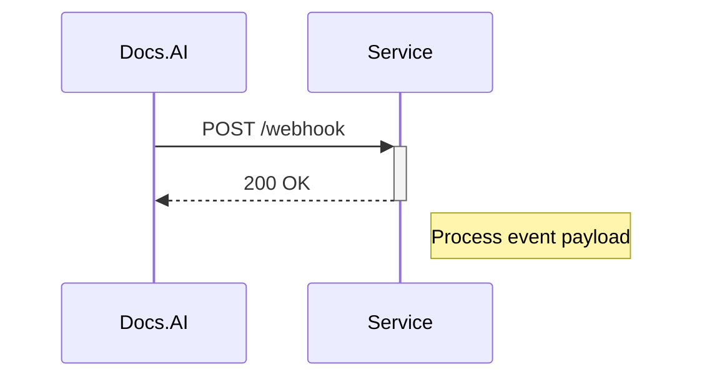

## Overview

Connect Documentation.AI to your favorite tools like GitHub and Slack to automate workflows and receive real-time notifications. Use webhooks for instant updates on documentation changes or leverage the API for custom integrations. These connections streamline collaboration and keep your team informed without manual effort.

<Columns cols={3}>
  <Card title="GitHub" icon="github" href="#github-setup">
    Sync repositories with your docs for automatic updates.
  </Card>
  <Card title="Slack" icon="message-circle" href="#slack-setup">
    Get notifications for doc publishes and reviews.
  </Card>
  <Card title="Webhooks" icon="zap" href="#webhooks">
    Trigger actions on events like page updates.
  </Card>
</Columns>

## GitHub Integration

Set up GitHub to automatically build and deploy documentation from your repositories.

<Steps>
  <Step title="Create a GitHub App" icon="settings">
    In your GitHub account, navigate to Settings > Developer settings > GitHub Apps. Create a new app with permissions for repository contents and metadata.
  </Step>
  <Step title="Configure Webhook" icon="link">
    Add the webhook URL: `https://api.example.com/v1/webhooks/github`. Select events like "push" and "pull_request".
  </Step>
  <Step title="Link in Dashboard" icon="dashboard">
    Go to Documentation.AI dashboard > Integrations > GitHub. Paste your App ID and private key.
  </Step>
</Steps>

<Callout kind="tip">
  Test the integration by pushing a commit to a linked repo. Verify sync status in the dashboard.
</Callout>

## Slack Notifications

Send alerts to Slack channels for key events.

### Quick Setup

<Tabs>
  <Tab title="Incoming Webhook" icon="arrow-up">
    Create a Slack app and get an incoming webhook URL. In Documentation.AI dashboard, add it under Integrations > Slack with channel `#docs-updates`.
  </Tab>
  <Tab title="Bot User" icon="bot">
    Install the Slack app to your workspace. Use the bot token `xoxb-YOUR_BOT_TOKEN` in the dashboard settings.
  </Tab>
</Tabs>

## Webhook Configuration

Webhooks enable real-time data flow. Configure them to receive payloads from Documentation.AI.



<CodeGroup tabs="cURL,Node.js,Python">
```bash
curl -X POST https://your-webhook-url.com/docs \
  -H "Content-Type: application/json" \
  -d '{
    "event": "doc_published",
    "doc_id": "12345",
    "title": "API Reference"
  }'
```
````javascript
const express = require('express');
const app = express();
app.use(express.json());

app.post('/webhook/docs', (req, res) => {
  const { event, doc_id, title } = req.body;
  console.log(`Event: ${event}, Doc: ${title}`);
  res.status(200).send('OK');
});

app.listen(3000);
````
```python
from flask import Flask, request, jsonify

app = Flask(__name__)

@app.route('/webhook/docs', methods=['POST'])
def webhook():
    data = request.json
    event = data.get('event')
    print(f"Received {event}")
    return jsonify({'status': 'ok'}), 200
```
</CodeGroup>

<ParamField header="X-Signature" param-type="string" required="true">
  HMAC SHA-256 signature for payload verification using your webhook secret.
</ParamField>

## Custom API Connections

Build bespoke integrations using the REST API.

<Request tabs="cURL,JavaScript">
```bash
curl -X POST https://api.example.com/v1/integrations \
  -H "Authorization: Bearer YOUR_API_KEY" \
  -H "Content-Type: application/json" \
  -d '{
    "name": "Custom CRM",
    "endpoint": "https://crm.example.com/api/docs",
    "events": ["publish", "update"]
  }'
```
````javascript
const response = await fetch('https://api.example.com/v1/integrations', {
  method: 'POST',
  headers: {
    'Authorization': 'Bearer YOUR_API_KEY',
    'Content-Type': 'application/json'
  },
  body: JSON.stringify({
    name: 'Custom CRM',
    endpoint: 'https://crm.example.com/api/docs',
    events: ['publish', 'update']
  })
});
````
</Request>

<Response tabs="200">
```json
{
  "id": "int_67890",
  "name": "Custom CRM",
  "status": "active"
}
```
</Response>

## Security Best Practices

<ExpandableGroup>
  <Expandable title="Verify Webhook Signatures" default-open="true">
    Always validate incoming payloads. Compute HMAC with your secret and compare against the `X-Signature` header.

    ```javascript
    const crypto = require('crypto');
    const signature = crypto
      .createHmac('sha256', 'YOUR_WEBHOOK_SECRET')
      .update(payload)
      .digest('hex');
    ```
  </Expandable>
  <Expandable title="Rotate Secrets Regularly">
    Change API keys and webhook secrets every 90 days. Use environment variables: `process.env.DOCS_WEBHOOK_SECRET`.
  </Expandable>
</ExpandableGroup>

<Callout kind="alert">
  Never expose secrets in client-side code or public repos. Use server-side handling for all integrations.
</Callout>

Explore more in the [dashboard](https://dashboard.example.com/integrations). These setups reduce manual work and boost team efficiency.